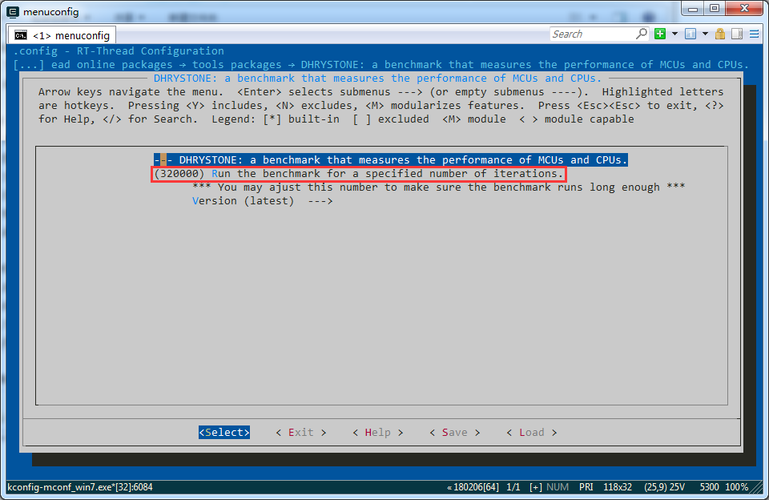

# Dhrystone

"DHRYSTONE" Benchmark Program by  Reinhold P. Weicker

RT-Thread 上的 MCU/CPU 性能测试小工具，在 menuconfig 里选中软件包后，在 msh 中输入：

```
msh> dhrystone_test
```

就可以看到跑分结果了，例如：

### STM32F103 (ARMCC -O3 -Otime) 跑分: 79 DMIPS & 1.09 DMIPS/MHz

```
 \ | /
- RT -     Thread Operating System
 / | \     4.0.2 build Oct 15 2019
 2006 - 2019 Copyright by rt-thread team
msh >
msh >dhrystone_test

Dhrystone Benchmark, Version 2.1 (Language: C)

Program compiled without 'register' attribute

Execution starts, 320000 runs through Dhrystone
Execution ends

Final values of the variables used in the benchmark:

Int_Glob:            5
        should be:   5
Bool_Glob:           1
        should be:   1
Ch_1_Glob:           A
        should be:   A
Ch_2_Glob:           B
        should be:   B
Arr_1_Glob[8]:       7
        should be:   7
Arr_2_Glob[8][7]:    320010
        should be:   Number_Of_Runs + 10
Ptr_Glob->
  Ptr_Comp:          536892000
        should be:   (implementation-dependent)
  Discr:             0
        should be:   0
  Enum_Comp:         2
        should be:   2
  Int_Comp:          17
        should be:   17
  Str_Comp:          DHRYSTONE PROGRAM, SOME STRING
        should be:   DHRYSTONE PROGRAM, SOME STRING
Next_Ptr_Glob->
  Ptr_Comp:          536892000
        should be:   (implementation-dependent), same as above
  Discr:             0
        should be:   0
  Enum_Comp:         1
        should be:   1
  Int_Comp:          18
        should be:   18
  Str_Comp:          DHRYSTONE PROGRAM, SOME STRING
        should be:   DHRYSTONE PROGRAM, SOME STRING
Int_1_Loc:           5
        should be:   5
Int_2_Loc:           13
        should be:   13
Int_3_Loc:           7
        should be:   7
Enum_Loc:            1
        should be:   1
Str_1_Loc:           DHRYSTONE PROGRAM, 1'ST STRING
        should be:   DHRYSTONE PROGRAM, 1'ST STRING
Str_2_Loc:           DHRYSTONE PROGRAM, 2'ND STRING
        should be:   DHRYSTONE PROGRAM, 2'ND STRING

Microseconds for one run through Dhrystone: 7
Dhrystones per Second:                      139130
VAX  MIPS rating:                           79
```

### GD32VF103CB (GCC -Os): 50 DMIPS & 0.46 DMIPS/MHz

```
 \ | /
- RT -     Thread Operating System
 / | \     4.0.2 build Oct 14 2019
 2006 - 2019 Copyright by rt-thread team
msh >
msh >dhrystone_test

Dhrystone Benchmark, Version 2.1 (Language: C)

Program compiled without 'register' attribute

Execution starts, 320000 runs through Dhrystone
Execution ends

Final values of the variables used in the benchmark:

Int_Glob:            5
        should be:   5
Bool_Glob:           1
        should be:   1
Ch_1_Glob:           A
        should be:   A
Ch_2_Glob:           B
        should be:   B
Arr_1_Glob[8]:       7
        should be:   7
Arr_2_Glob[8][7]:    320010
        should be:   Number_Of_Runs + 10
Ptr_Glob->
  Ptr_Comp:          536884636
        should be:   (implementation-dependent)
  Discr:             0
        should be:   0
  Enum_Comp:         2
        should be:   2
  Int_Comp:          17
        should be:   17
  Str_Comp:          DHRYSTONE PROGRAM, SOME STRING
        should be:   DHRYSTONE PROGRAM, SOME STRING
Next_Ptr_Glob->
  Ptr_Comp:          536884636
        should be:   (implementation-dependent), same as above
  Discr:             0
        should be:   0
  Enum_Comp:         1
        should be:   1
  Int_Comp:          18
        should be:   18
  Str_Comp:          DHRYSTONE PROGRAM, SOME STRING
        should be:   DHRYSTONE PROGRAM, SOME STRING
Int_1_Loc:           5
        should be:   5
Int_2_Loc:           13
        should be:   13
Int_3_Loc:           7
        should be:   7
Enum_Loc:            1
        should be:   1
Str_1_Loc:           DHRYSTONE PROGRAM, 1'ST STRING
        should be:   DHRYSTONE PROGRAM, 1'ST STRING
Str_2_Loc:           DHRYSTONE PROGRAM, 2'ND STRING
        should be:   DHRYSTONE PROGRAM, 2'ND STRING

Microseconds for one run through Dhrystone: 11
Dhrystones per Second:                      89385
VAX  MIPS rating:                           50
```

更多测试结果可以在这里看到：

**https://blog.stratifylabs.co/device/2019-05-20-Dhrystone-Benchmarking-on-MCUs/**

## 注意事项

- 如果 MCU 性能太强劲一下就测试结束了，得不到有效结果，可以适当增加图中的迭代次数


